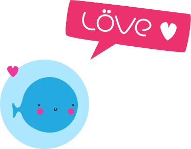
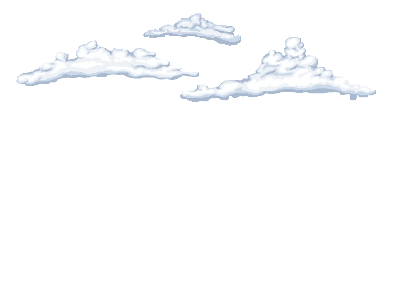
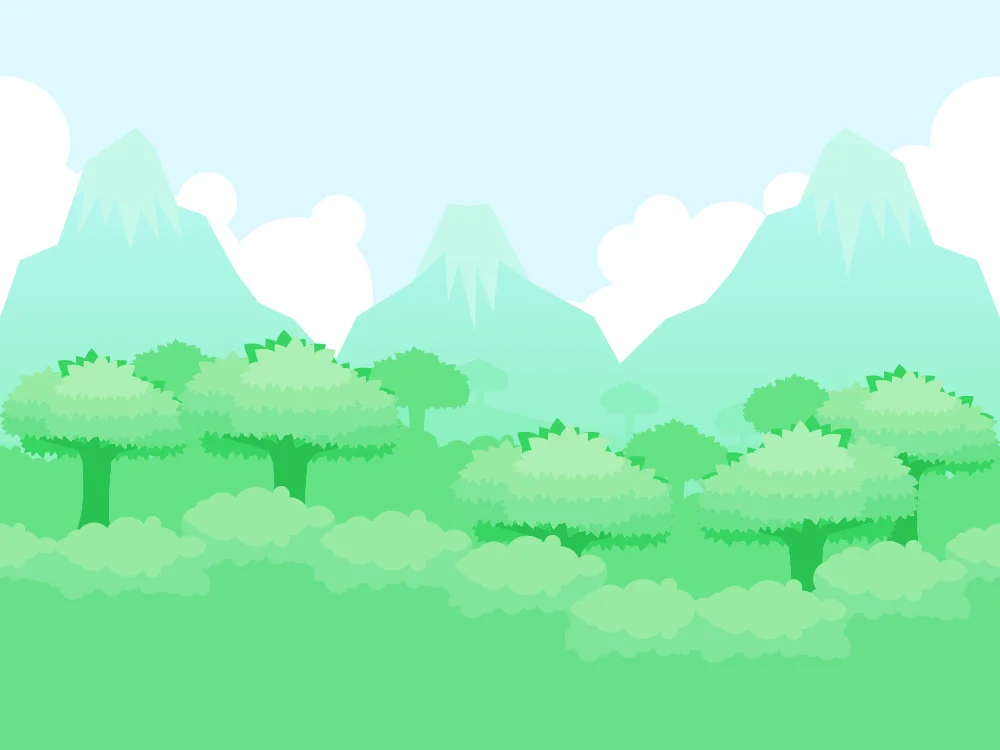
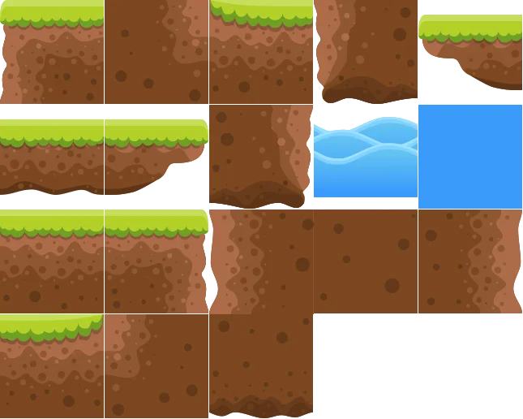
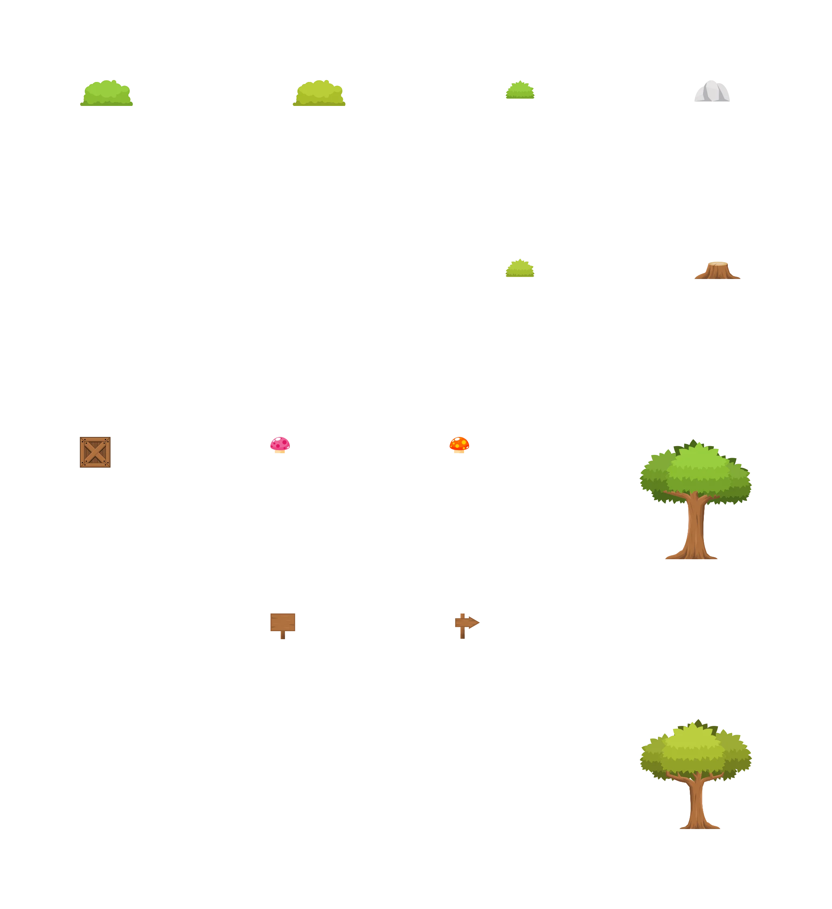
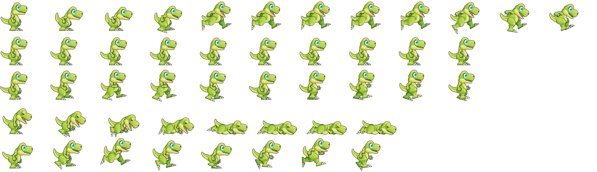
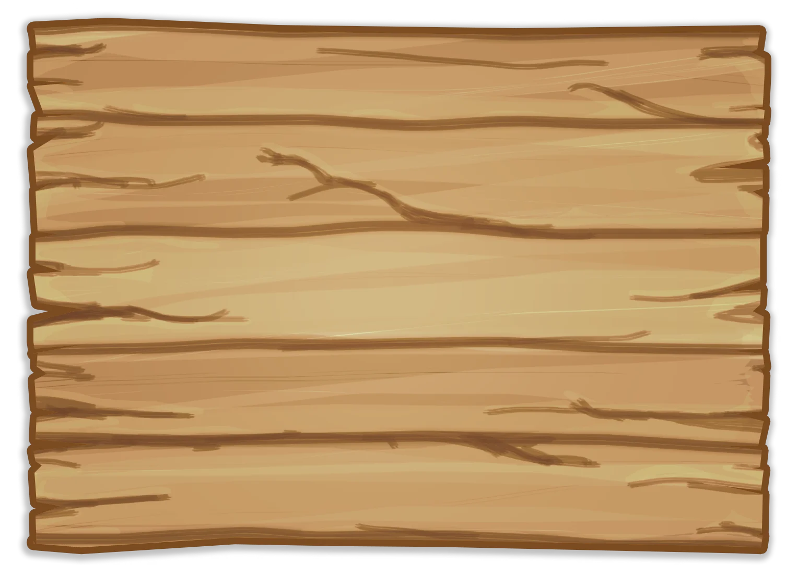
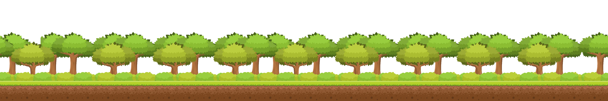
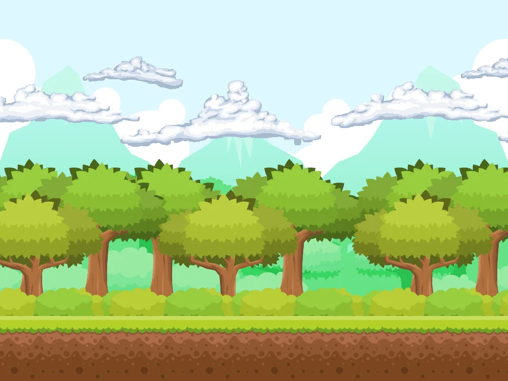
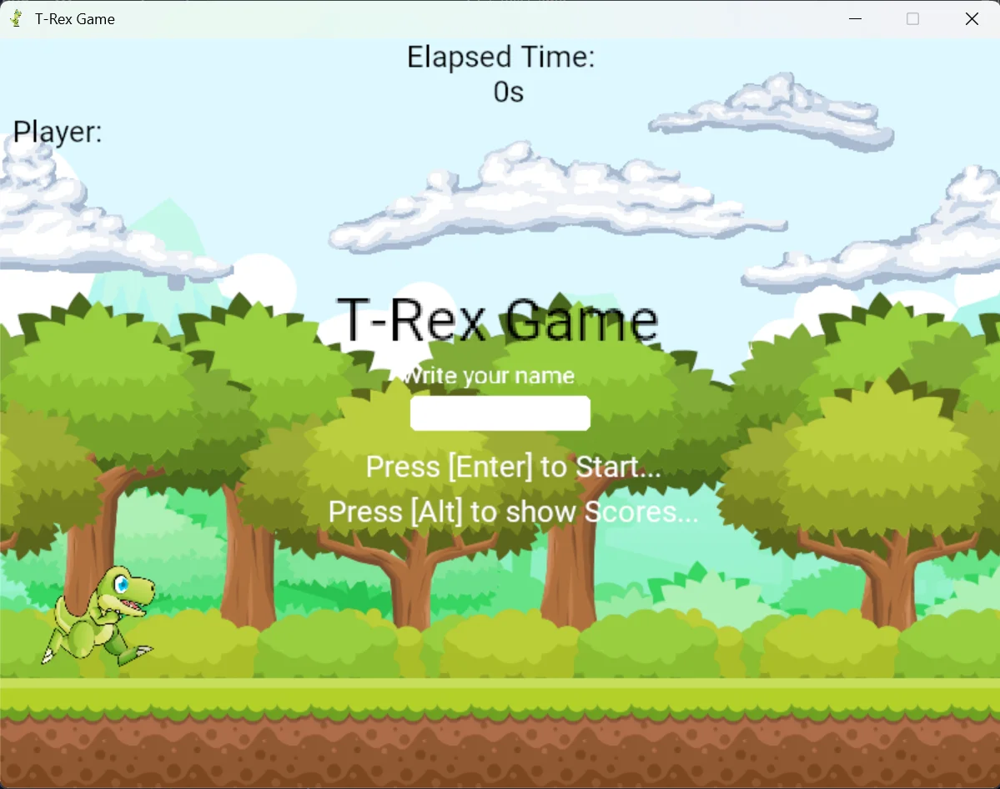

## T-Rex Game.
Un Juego T-Rex hecho con Lua y Love.

* *Para probar el juego sólo debes descargar el:* **T-Rex Game_release.zip** *y ejecutar el .exe*

## Herramientas Utilizadas.
- [x] **Love:** Framework para desarrollar juegos en 2D.
[Website](https://love2d.org/)

    

- [x] **Lua:** Lenguaje de programación integrable, potente ligero.
[Website](https://www.lua.org/)

    

## Librerias.
1. **Hump:** una colección pequeña de herramientas para desarrollar juegos en Love. 
[Repositorio](https://github.com/vrld/hump)

2. **Anim8:** libreria de animación para Love. 
[Repositorio](https://github.com/kikito/anim8)

3. **dkjson:** modulo de JSON escrito en lua. 
[Website](http://dkolf.de/dkjson-lua/)

## Sprites:
sprites obtenidas desde: [OpenGameArt.Org](https://opengameart.org/)
1. **Nubes:** [Link](https://opengameart.org/content/2d-clouds) autor: *kitart360*

    

2. **Tiles**: [Link](https://opengameart.org/content/free-platformer-game-tileset) autor: *pzUH*

    

    

    

3. **T-Rex:** [Link](https://opengameart.org/content/free-platformer-game-tileset) autor: *pzUH*

    

4. **Tablero de Puntajes:** [Link](https://opengameart.org/content/game-wood-panel) autor: *PINKCANNON*

    

5. **Nivel:** autor: *Sirion2*
    
    

## Capturas.

1. **Mapa**:

    

2. **Inicio**:

    

3. **Tablero de Puntajes**:
    
    

## Gameplay.
Hecha un vistazo a juego.

**Iniciar Juego video:** https://youtu.be/Rzu_LkTVIis?si=ekSg-vwn4uraWerF

**Tablero de Puntajes:** https://youtu.be/yYjhXXGqBRY?si=P29mGBrDFgSWyJpp
